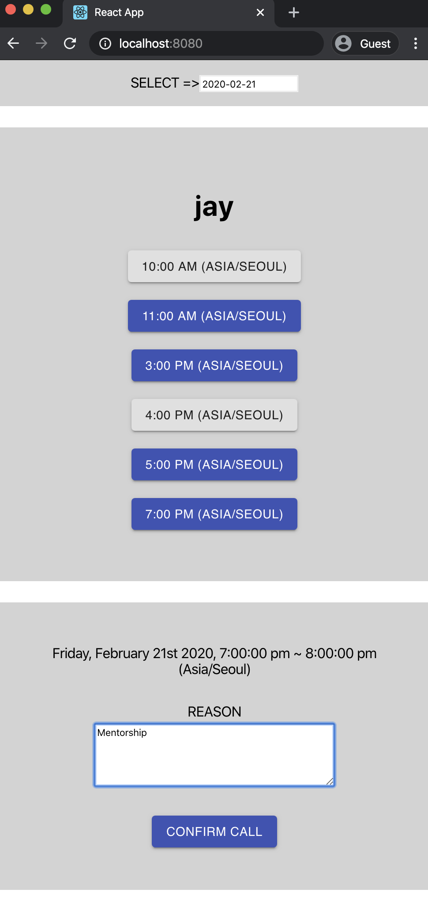

# Start

## Requirements

- JDK 8+ 
- Node 12+

## Run

```bash
$ git clone https://github.com/shinjaeuk/simple-calendar.git
$ cd simple-calendar
$ ./build.sh
....
$ ./run.sh
.... ( contro + c to exit )
```

Access : http://localhost:8080/

## How

> This web site is view of student. ( no metor side )
>
> Mentor has availble time from 21, Feb 2020 to 23, Feb 2020
>
> The meeting is only hour
>
> If restart app, data is reset  ( use to in-memory db - H2, data.sql)

### Select Date to make call with mentor


### Select available time


### Type reson and click cnfirm call button




# Project Structure

This project contains Java Sprint Boot and React.JS Because of samll proejct

Java (Back-end) 

- Spring Boot (2.2)
- Spring MVC
- Spring JPA
- H2DB

Java Script (Front-end)

- React.js (16)
- axios
- moment
- meterial-ui

```
root (Java Proejct )
  ├── src
  │   └── main
  │       └── java
  ...
  └── webapp ( React.JS Proejct )
```

# Back-end

## API

- GET /mentors/{id}/agenda (  get ever data  )
  - Get a mentor's available times to make the schedule
  - If the mentor is not found, It returns HTTP 404 
- POST /mentors/{id}/agenda/{id}, request body { reasone : '' }
  - Make schedule
  - If time is not available, It returns HTTP 409

## ERD

- Mentor has available times ( Available time is 'true' at the first time)
- If student make the schedule, available time will be updated by 'false'


# Front-end

